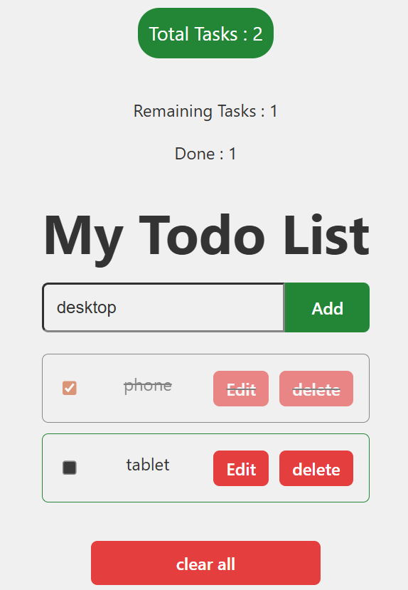
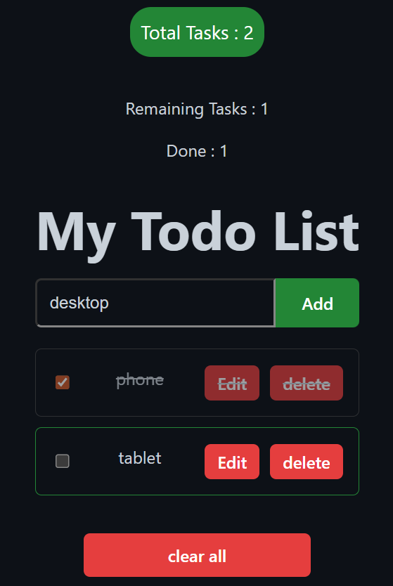

# React Todo App

A modern, feature-rich Todo List application built with React + Vite. Supports dark/light mode, task editing, persistence, and more.

## Live Demo
https://agmyathtun.github.io/todo-react-one/

## Features
- Add, edit, delete, and mark tasks as done
- Clear all completed tasks
- Real-time remaining / total / done counts
- Dark / light mode toggle
- LocalStorage persistence (tasks saved after refresh)
- Responsive design (mobile-friendly)

## Tech Stack
- React 18
- Vite (fast dev server & build tool)
- useState + useEffect hooks
- Controlled inputs & forms
- Component composition (props + children)
- GitHub Pages deployment

## Screenshots

### Light Mode – Adding Tasks


### Dark Mode – Editing Task



## How to Run Locally

```bash
git clone https://github.com/Agmyathtun/todo-react-one.git
cd todo-react-one
npm install
npm run dev